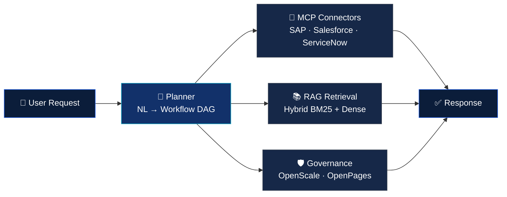

<div align="center">

# Chandan Kumar

### Lead Data Scientist @ IBM Lab — Agentic AI · GenAI · Enterprise MLOps


[](mailto:chandaniitismg@gmail.com)
[](https://www.linkedin.com/in/chandaniit)


</div>

---

## 🚀 About Me

```yaml
Name:           Chandan Kumar
Title:          Lead Data Scientist @ IBM Lab
Location:       Bengaluru, India
Experience:     8+ years in AI/ML & Data Science
Education:      B.Tech, IIT (ISM) Dhanbad (2013–2017)
Background:     Super 30 Alumni
Focus:          Agentic AI · GenAI · LLMs · RAG · MLOps · Computer Vision
Currently:      Architecting agentic AI systems powering IBM Watsonx
                (Orchestrate, watsonx.ai, watsonx.governance, IBM Cloud)
Impact:         $4M+ verified business impact · 8 production deployments
                15+ enterprise AI/GenAI POCs across IBM, AWS, GCP & Azure
```

IIT graduate and **Super 30 Alumni** with 8+ years turning AI from whiteboard to measurable business outcome — across **IBM Watsonx**, **AWS Bedrock/SageMaker**, and **Azure ML**. Three platforms, three arenas, one through-line.

---

## 🧠 What I'm Building — IBM Watsonx Orchestrate (Weave)

The agentic lifecycle framework I lead engineering on at IBM: natural-language requirements → workflow DAG → validated, deployed agent.



**10M+ daily API calls · p99 &lt;200ms · 99.9% uptime · 60+ enterprise MCP connectors**

---

## 💼 Career Highlights

| Company | Role | Period | Signature Result |
|---|---|---|---|
| **IBM Lab** | Lead Data Scientist | 2024 – Present | watsonx Orchestrate — 10M+ daily API calls, IBM's reference multi-agent platform |
| **Accenture** | Data Science Analyst | 2021 – 2024 | HyDE-RAG bank advisor (NatWest Group) — 45% faster resolution, zero hallucinations |
| **Accenture** (Facebook BI) | Data Science Analyst | 2021 – 2024 | Real-time CV at 1B+ images/day, &lt;50ms latency |
| **Clean Harbors** | Data Scientist, AI/ML | 2018 – 2021 | EPA-compliant waste classification — $500K/yr saved, zero violations |

---

## 🛠️ Tech Stack

**Agentic AI & LLMs**


**RAG & Knowledge Systems**


**ML & Deep Learning**


**Cloud Platforms**


**Data & Engineering**


**MLOps & Governance**


---

## 📜 Certifications

`Northwestern University` · `IBM AI Associate Data Scientist` · `Databricks GenAI Fundamentals` · `Stanford Machine Learning` · `LangChain Academy — LangGraph & LangSmith` · `Anthropic — MCP Advanced Topics` · `Hugging Face AI Agents` · `Duke — DevOps/DataOps/MLOps` · `Microsoft Azure ML` · `IBM Trustworthy AI & Ethics` · `IBM Solution Architect — Kubernetes & Cloud Paks` · `IBM Generative & Agentic AI Foundation`

---

## 📊 GitHub Stats

<div align="center">


</div>

---

## 📫 Let's Connect

<div align="center">

[](mailto:chandaniitismg@gmail.com)
[](https://www.linkedin.com/in/chandaniit)

</div>
